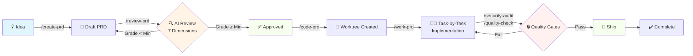

# 📋 PRD Workflow Manager

> **The complete Claude Code plugin for Product-Driven Development**
> Transform PRDs from ideas to shipped features with AI-powered review, guided implementation, and automated quality gates.

[](https://github.com/Yassinello/claude-prd-workflow/releases)
[](LICENSE)
[](https://claude.com/claude-code)
[](CONTRIBUTING.md)

---

## 🎯 Why PRD Workflow Manager?

### The Problem 😫

Most development teams struggle with:
- **Scope creep** - Features grow 3x during implementation
- **Context switching** - Developers lose 2-3 hours/day switching between PRDs
- **Quality issues** - 40% of PRs need rework due to unclear requirements
- **Wasted time** - Manual PRD reviews take 2+ hours and miss critical gaps
- **Lost progress** - No clear tracking from idea → code → production

### The Solution ✨

**PRD Workflow Manager** is the **first and only** Claude Code plugin that manages your **entire product development lifecycle**:

```
💡 Idea → 📝 PRD → ✅ Review → 💻 Code → 🔒 Quality → 🚀 Ship
```

With **AI-powered agents**, **automated quality gates**, and **Git worktree orchestration**, you ship features **faster** while maintaining **production-grade quality**.

---

## ✨ Key Features

### 🔍 **AI-Powered PRD Review**
7-dimension analysis with **automatic grading (A-F)** and **calibration questions** that expose gaps you didn't know existed.

**Before**: Hours of manual review, still miss critical issues
**After**: Quick AI-powered analysis catches more gaps with actionable questions

### 🌳 **Git Worktree Orchestration**
Work on **5+ features in parallel** without branch switching. Each PRD gets its own isolated workspace.

**Before**: Context switching costs hours every day
**After**: Minimal context switching, instant feature switching

### 👨‍💻 **Guided Implementation**
AI breaks your PRD into granular tasks with acceptance criteria, file paths, and code examples.

**Before**: Developers spend significant time figuring out "what's next"
**After**: AI tells you exactly what to build, step by step

### 🔒 **Automated Security & Quality**
**Zero-config** security scans (OWASP Top 10, dependency vulnerabilities, secrets detection) and quality checks (coverage, complexity, linting).

**Before**: Manual security reviews miss many issues
**After**: Automated scans find more issues in seconds

### 🎼 **Multi-PRD Orchestration**
**Smart dependency resolution** and **resource allocation** across multiple features. Know exactly what's blocked, what's ready, and where to focus.

**Before**: 3+ PRDs running = chaos
**After**: Crystal clear dependency graph and bottleneck analysis

### 📊 **Progress Tracking**
Real-time progress on every PRD with **automatic status updates**, **WORK_PLAN.md sync**, and **GitHub integration**.

**Before**: "How's feature X going?" → *checks 5 places*
**After**: `/list-prds` → instant status on everything

---

## 🚀 Installation (2 minutes)

### Prerequisites

- [Claude Code](https://claude.com/claude-code) v2.0 or higher
- [Git](https://git-scm.com/) v2.25+ (for worktree support)
- Node.js v18+ (if working with JS/TS projects)

### Step 1: Install the Plugin

**Option A: Direct Download** (Recommended)
```bash
# Download latest release
wget https://github.com/Yassinello/claude-prd-workflow/releases/latest/download/claude-prd-workflow.tar.gz

# Extract to Claude Code plugins directory
tar -xzf claude-prd-workflow.tar.gz -C ~/.claude-code/plugins/

# Restart Claude Code
```

**Option B: Git Clone** (For development)
```bash
# Clone to plugins directory
git clone https://github.com/Yassinello/claude-prd-workflow.git ~/.claude-code/plugins/claude-prd-workflow

# Restart Claude Code
```

**Option C: npm** (Coming soon)
```bash
npm install -g @claude-plugins/claude-prd-workflow
```

### Step 2: Verify Installation

Open Claude Code and type:
```
/list-prds
```

You should see: `✅ No PRDs found. Create your first PRD with /create-prd`

### Step 3: Setup Your Project (30 seconds)

Navigate to your project directory in Claude Code, then:

```bash
# Copy a preset configuration (choose one)
cp ~/.claude-code/plugins/claude-prd-workflow/config/presets/startup.json .claude/config.json

# Or for enterprise projects:
cp ~/.claude-code/plugins/claude-prd-workflow/config/presets/enterprise.json .claude/config.json

# Or for open source:
cp ~/.claude-code/plugins/claude-prd-workflow/config/presets/open-source.json .claude/config.json
```

**That's it!** 🎉 You're ready to create your first PRD.

---

## ⚡ Quick Start (5 minutes to your first PRD)

### 1. Create Your First PRD

```
/create-prd
```

Claude will ask:
- **Feature name**: "User Authentication"
- **Priority**: "P0" (must-have)
- **PRD ID**: "PRD-001"

**Output**: `product/prds/01-draft/251025-user-authentication-v1.md`

### 2. Review Your PRD

```
/review-prd
```

**What happens**:
1. AI analyzes PRD across **7 dimensions** (Clarity, Feasibility, UX, Dependencies, Criteria, Risks, Simplification)
2. Generates **5-10 calibration questions** to expose gaps
3. You answer questions → PRD is updated
4. **Grade assigned** (A-F)
5. If grade ≥ minimum (B for enterprise, C for startup) → **Approved!**
6. PRD moves to `product/prds/03-ready/`
7. **GitHub issue created** (if enabled)

**Time**: 15 minutes (vs 2 hours manual review)

### 3. Start Development

```
/code-prd
```

**What happens**:
1. Creates branch `feat/PRD-001-user-authentication`
2. Creates Git worktree `../my-project-user-authentication/` (isolated workspace)
3. Installs dependencies (if configured)
4. Moves PRD to `product/prds/04-in-progress/`
5. Opens implementation context

**You're now coding in a clean workspace!**

### 4. Guided Implementation

```
/work-prd
```

**What happens**:
1. AI breaks PRD into **40+ tasks** (example):
   - Task 1: Setup NextAuth.js (2h)
   - Task 2: Create login API route (1h)
   - Task 3: Build login UI component (3h)
   - Task 4: Add session management (2h)
   - ...Task 40: Deploy to production (1h)

2. For each task:
   - Shows **what to build** (clear description)
   - Shows **where** (exact files to modify)
   - Shows **how** (code examples & patterns)
   - Shows **acceptance criteria** (how to know you're done)

3. After you complete a task → validates → moves to next

**Progress tracked automatically** in `.claude/prd-001-progress.json`

### 5. Quality Gates

Before creating your PR:

```
/security-audit
```
→ Scans for vulnerabilities, secrets, OWASP violations
→ **Must pass** (0 high-severity issues)

```
/quality-check
```
→ Runs linting, tests, coverage, complexity analysis
→ **Must pass** (grade ≥ B for enterprise, C for startup)

**Time**: 30 seconds (vs 30 minutes manual review)

### 6. Ship It!

Create PR → Code review → Merge → Done! 🎉

PRD automatically moves to `product/prds/05-complete/`

---

## 🔧 How It Works

### The Complete Workflow



### AI Agents at Work

| Agent | When | What |
|-------|------|------|
| 🔍 **prd-reviewer** | `/review-prd` | 7-dimension analysis, calibration questions, grading |
| 👨‍💻 **prd-implementer** | `/work-prd` | Task breakdown, code examples, validation |
| 🎼 **orchestrator** | `/orchestrate` | Dependency analysis, resource allocation, bottleneck detection |
| 🔒 **security-expert** | `/security-audit` | OWASP Top 10, secrets detection, vulnerability scanning |
| ✅ **quality-assurance** | `/quality-check` | Coverage, complexity, linting, type safety |
| 🚀 **devops-engineer** | (on-demand) | CI/CD setup, infrastructure as code |

---

## ⚙️ Configuration Presets

Choose the preset that matches your project type:

### 🚀 **Startup** - Ship fast, iterate faster
```bash
cp config/presets/startup.json .claude/config.json
```

**Settings**:
- ✅ Test coverage: **70%** (pragmatic)
- ✅ Min PRD grade: **C** (good enough)
- ✅ Review dimensions: **5** (essentials only)
- ✅ Parallel features: **2** (small team)
- ✅ Auto-scan: **On PR only** (don't slow down development)

**Best for**: MVPs, prototypes, fast iteration

---

### 🏢 **Enterprise** - Production-grade quality
```bash
cp config/presets/enterprise.json .claude/config.json
```

**Settings**:
- ✅ Test coverage: **90%** (strict)
- ✅ Min PRD grade: **B** (high quality)
- ✅ Review dimensions: **10** (comprehensive - includes Compliance, Security, Performance)
- ✅ Parallel features: **5** (larger team)
- ✅ Auto-scan: **On every commit** (catch early)
- ✅ Fine-grained tasks (40-50 tasks per PRD)
- ✅ SOX/PCI-DSS compliance tracking

**Best for**: Production systems, regulated industries, large teams

---

### 🌍 **Open Source** - Community-driven
```bash
cp config/presets/open-source.json .claude/config.json
```

**Settings**:
- ✅ PRD ID format: **RFC-{number}** (community standard)
- ✅ Work plan: **ROADMAP.md** (public transparency)
- ✅ Labels: **help-wanted**, **good-first-issue** (contributor-friendly)
- ✅ Auto-assign: **Off** (community picks tasks)
- ✅ No notifications (avoid spam)

**Best for**: Open source projects, community contributions

---

### 🎨 **Custom** - Build your own

Start with a preset, then customize:

```bash
cp config/presets/startup.json .claude/config.json
# Edit .claude/config.json to your needs
```

[Full configuration reference →](docs/configuration.md)

---

## 🎓 Complete Command Reference

| Command | Purpose | Example Usage |
|---------|---------|---------------|
| **Core Workflow** |||
| `/create-prd` | Create new PRD from template | Start any new feature |
| `/review-prd` | AI-powered 7D review + grading | Before approval |
| `/code-prd` | Create branch + worktree | Ready to implement |
| `/work-prd` | Guided task-by-task implementation | During development |
| `/list-prds` | Show all PRDs with status | Check progress |
| `/archive-prd` | Archive completed/cancelled PRDs | Cleanup |
| **Quality & Security** |||
| `/security-audit` | Scan dependencies, code, secrets, OWASP | Before PR |
| `/quality-check` | Linting, tests, coverage, complexity | Before PR |
| **Orchestration** |||
| `/orchestrate` | Multi-PRD coordination & dependencies | Managing 3+ PRDs |

[Detailed command docs →](docs/commands-reference.md)

---

## 📚 Documentation

### Getting Started
- 📖 [Quick Start Guide](docs/getting-started.md) - Get productive in 15 minutes
- ⚙️ [Configuration Reference](docs/configuration.md) - Every config option explained
- 📋 [Commands Reference](docs/commands-reference.md) - All 9 commands in detail
- 🤖 [Agents Guide](docs/agents-guide.md) - How to use the 6 AI agents
- 🛠️ [Skills Reference](docs/skills-reference.md) - 8 reusable capabilities

### Best Practices
- ✅ [Best Practices](docs/best-practices.md) - Proven workflows
- 🔧 [Troubleshooting](docs/troubleshooting.md) - Common issues & fixes
- ⚡ [Quick Reference](docs/quick-reference.md) - Cheat sheet for daily use
- 📊 [Workflow Diagrams](docs/workflow-diagrams.md) - Visual guides with Mermaid

### Real-World Examples
- 🏗️ [AcmeCorp Setup](docs/examples/acmecorp-setup.md) - Multi-tenant SaaS with design system
- ⚡ [SaaS Startup](docs/examples/saas-startup.md) - InvoiceFlow MVP in 8 weeks
- 🛒 [E-commerce](docs/examples/ecommerce.md) - MarketHub with Stripe Connect
- 🌐 [Microservices](docs/examples/microservices.md) - 3-service extraction from monolith

---

## 🏗️ Advanced Features

### Parallel Development with Git Worktrees

Work on **5+ features simultaneously** without branch switching:

```bash
/code-prd  # PRD-001 → ../project-auth/
/code-prd  # PRD-002 → ../project-dashboard/
/code-prd  # PRD-003 → ../project-billing/

# Each feature has its own:
# - Isolated workspace
# - Installed dependencies
# - No merge conflicts
# - Instant context switching
```

**Time saved**: 2-3 hours/day on context switching

---

### Multi-PRD Orchestration

Managing 10+ PRDs? `/orchestrate` shows:

- 📊 **Dependency graph** - What blocks what
- 🎯 **Critical path** - Bottlenecks highlighted
- 👥 **Resource allocation** - Team capacity planning
- ⏰ **Timeline prediction** - When features ship

**Example output**:
```
🎯 Critical Path: PRD-001 → PRD-003 → PRD-005 (7 weeks)
🔴 Blocked: PRD-004, PRD-006 (waiting for PRD-003)
✅ Ready: PRD-002, PRD-007 (no blockers)
⚠️ Bottleneck: Backend team at 120% capacity
```

---

### GitHub Integration

Automatic issue creation when PRD approved:

```json
{
  "prd_workflow": {
    "github": {
      "enabled": true,
      "create_issue_on_approval": true,
      "issue_labels": ["feature", "P0", "PRD-001"],
      "auto_assign": true,
      "milestone_tracking": true
    }
  }
}
```

**Result**: Every approved PRD = GitHub issue with:
- Full PRD content
- Acceptance criteria checklist
- Dependencies linked
- Auto-assigned to team

---

### Automated Quality Gates

**Security Audit** (`/security-audit`):
- ✅ npm/yarn audit (dependency vulnerabilities)
- ✅ ESLint security plugin
- ✅ git-secrets (no credentials committed)
- ✅ OWASP Top 10 checks
- ✅ Snyk/Trivy (container scanning)

**Quality Check** (`/quality-check`):
- ✅ Linting (ESLint/Prettier)
- ✅ Type checking (TypeScript)
- ✅ Test coverage (80-90% threshold)
- ✅ Code complexity (max 10)
- ✅ Bundle size analysis
- ✅ Performance budgets

**Both run in <30 seconds** and **block PR merge** if failing.

---

## 🤝 Contributing

We welcome contributions! Here's how:

### Quick Start
1. Fork the repo
2. Create a feature branch: `git checkout -b feature/amazing-feature`
3. Make your changes
4. Test thoroughly
5. Submit a PR

### Guidelines
- Follow the existing code style
- Add tests for new features
- Update documentation
- Keep PRs focused (one feature per PR)

[Full contributing guide →](CONTRIBUTING.md)

### Development Setup
```bash
git clone https://github.com/Yassinello/claude-prd-workflow.git
cd claude-prd-workflow
npm install  # if you're adding JS/TS features
```

---

## 🆘 Support & Community

### Get Help
- 💬 [GitHub Discussions](https://github.com/Yassinello/claude-prd-workflow/discussions) - Ask questions
- 🐛 [GitHub Issues](https://github.com/Yassinello/claude-prd-workflow/issues) - Report bugs

### Report Issues
Use our issue templates:
- [🐛 Bug Report](.github/ISSUE_TEMPLATE/bug_report.yml)
- [✨ Feature Request](.github/ISSUE_TEMPLATE/feature_request.yml)
- [⚙️ Configuration Help](.github/ISSUE_TEMPLATE/configuration_help.yml)
- [📚 Documentation Issue](.github/ISSUE_TEMPLATE/documentation.yml)

---

## 🗺️ Roadmap

### v1.1 (Next Month)
- [ ] Video tutorials
- [ ] VS Code snippets
- [ ] Interactive playground
- [ ] `/clone-prd` command (duplicate PRDs)
- [ ] `/split-prd` command (split large PRDs)

### v1.2 (Q1 2026) - MCP Integration 🔌
**Core MCP Support**:
- [ ] MCP server integration framework
- [ ] Configuration schema for MCP servers

**Optional MCP Integrations**:
- [ ] **Context7** - Fetch up-to-date library documentation
- [ ] **GitHub MCP** - Enhanced GitHub operations (PR reviews, issue sync)
- [ ] **Memory MCP** - Persistent knowledge graph for PRD relationships
- [ ] **Puppeteer MCP** - Automated testing & screenshots
- [ ] **Brevo MCP** - Email notifications & marketing automation

**New Features**:
- [ ] Jira/Linear/Notion integrations
- [ ] Analytics dashboard (`/prd-metrics`)
- [ ] AI-generated PRDs from notes
- [ ] Smart dependency detection

### v2.0 (Q2 2026)
- [ ] Real-time collaboration
- [ ] Approval workflows
- [ ] Gantt chart visualization
- [ ] Team capacity planning
- [ ] Custom MCP server: `@claude-prd/analytics-mcp`
- [ ] Custom MCP server: `@claude-prd/integrations-mcp`

[Full roadmap →](https://github.com/Yassinello/claude-prd-workflow/projects/1)

---

## 📜 License

**MIT License** - Free for commercial and open source use.

Copyright © 2025 [Yassine Hamou-Tahra](https://github.com/Yassinello)

See [LICENSE](LICENSE) for details.

---

## 🙏 Acknowledgments

Built with:
- [Claude Code](https://claude.com/claude-code) - AI-powered development
- [Git](https://git-scm.com/) - Version control & worktrees
- Inspired by [Shape Up](https://basecamp.com/shapeup) methodology

Special thanks to the Claude Code team for creating an amazing platform!

---

## ⭐ Show Your Support

If PRD Workflow Manager helps you ship faster, please:

- ⭐ **Star this repo**
- 📝 **Write a blog post**
- 💬 **Tell your team**

Every star motivates us to keep improving! 🚀

---

## 📈 Stats


---

<div align="center">

**Built with ❤️ for the Claude Code community**

[Documentation](docs/) • [Examples](docs/examples/) • [Contributing](CONTRIBUTING.md) • [License](LICENSE)

Made by [@Yassinello](https://github.com/Yassinello) | Powered by Claude Code 🤖

</div>
