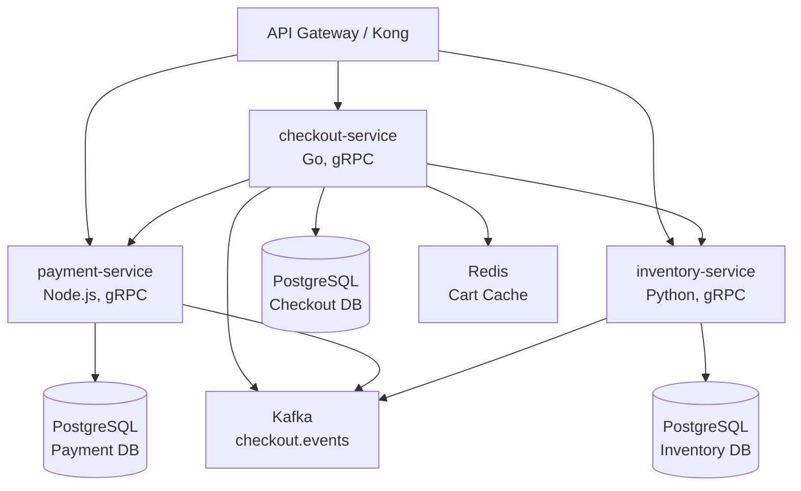

# Microservices Architecture - Distributed System Example

**Project Type**: Microservices Platform Migration
**Team Size**: 15-20 developers (4-5 teams)
**Tech Stack**: Node.js, Go, Python, Kubernetes, gRPC, Kafka, PostgreSQL, Redis, Elasticsearch
**Deployment**: AWS EKS, ArgoCD, Terraform
**Scale**: 1M+ requests/day, 50+ services

---

## Overview

This example shows how a large engineering organization uses the PRD Workflow Manager to coordinate **cross-team microservices development** with complex dependencies, orchestration, and DevOps automation.

**Key Characteristics**:
- **Multi-team coordination** (4-5 teams working in parallel)
- **Service dependencies** (complex dependency graphs)
- **Infrastructure as Code** (Terraform, Kubernetes manifests)
- **API contracts** (gRPC, OpenAPI schemas)
- **Distributed tracing** (Jaeger, OpenTelemetry)
- **Service mesh** (Istio)
- **CI/CD automation** (GitHub Actions, ArgoCD)

---

## Configuration

Custom enterprise configuration for microservices:

### `.claude/config.json`

```json
{
  "prd_workflow": {
    "enabled": true,
    "directories": {
      "draft": "docs/prds/draft",
      "review": "docs/prds/review",
      "ready": "docs/prds/ready",
      "in_progress": "docs/prds/in-progress",
      "complete": "docs/prds/complete",
      "archived": "docs/prds/archived"
    },
    "branch_naming": {
      "prefix": "feat",
      "prd_id_format": "SVC-{number}",
      "separator": "-",
      "pattern": "{prefix}/{prd_id}{separator}{service_name}"
    },
    "worktree": {
      "enabled": true,
      "parent_directory": "../worktrees",
      "naming_pattern": "{project}-{prd_id}",
      "auto_install_dependencies": true,
      "auto_open_editor": false
    },
    "github": {
      "enabled": true,
      "create_issue_on_approval": true,
      "issue_labels": ["microservice", "P0", "P1", "P2", "api-contract", "breaking-change"],
      "auto_assign": true,
      "milestone_tracking": true,
      "team_based_routing": true
    },
    "review": {
      "dimensions": [
        "Clarity & Scope",
        "Technical Feasibility",
        "API Design & Contracts",
        "Dependencies & Integration",
        "Acceptance Criteria",
        "Risk Assessment",
        "Service Mesh Compatibility",
        "Observability & Monitoring",
        "Performance & Scalability",
        "Deployment Strategy"
      ],
      "grading_enabled": true,
      "minimum_grade": "B",
      "require_approval": true,
      "calibration_questions": true,
      "require_architecture_decision": true,
      "require_api_contract": true
    }
  },
  "security": {
    "enabled": true,
    "auto_scan_on_commit": true,
    "scan_dependencies": true,
    "scan_code": true,
    "container_scanning": true,
    "tools": {
      "trivy": true,
      "snyk": true,
      "gosec": true
    }
  },
  "quality": {
    "enabled": true,
    "testing": {
      "enabled": true,
      "coverage_threshold": 85,
      "required_for_pr": true,
      "contract_testing": true,
      "integration_testing": true,
      "e2e_testing": true
    },
    "api_validation": {
      "enabled": true,
      "openapi_validation": true,
      "grpc_validation": true,
      "breaking_change_detection": true
    }
  },
  "orchestration": {
    "enabled": true,
    "parallel_features": 10,
    "dependency_resolution": true,
    "cross_team_coordination": true,
    "service_mesh_integration": true,
    "feature_flags": true,
    "canary_deployments": true
  },
  "agents": {
    "orchestrator": {
      "enabled": true,
      "coordination_mode": "smart",
      "cross_service_dependencies": true
    },
    "devops_engineer": {
      "enabled": true,
      "auto_setup_ci": true,
      "infrastructure_as_code": true,
      "kubernetes_manifests": true,
      "service_mesh_config": true
    }
  }
}
```

---

## Project: "CloudScale" - Microservices Platform

### Platform Architecture

**Current State**: Monolith (500K lines of code)
**Target State**: 50+ microservices

**Service Categories**:
1. **API Gateway** (Kong, GraphQL Federation)
2. **Core Services** (Auth, User, Organization)
3. **Business Logic Services** (Orders, Inventory, Pricing)
4. **Data Services** (Analytics, Reporting)
5. **Infrastructure Services** (Logging, Tracing, Metrics)

---

## Q2 2025: Checkout Service Extraction

### Multi-Service PRD: Checkout Microservice

**Scope**: Extract checkout flow from monolith into 3 new services
**Teams Involved**: 3 teams (Checkout, Payments, Inventory)
**Services**: `checkout-service`, `payment-service`, `inventory-service`
**Timeline**: 16 weeks

---

### PRD Structure for Microservices

**PRD-128: Checkout Service Extraction**

```markdown
# PRD-128: Checkout Service Extraction

**Type**: Microservice Migration
**Priority**: P0
**Complexity**: Very High
**Teams**: Checkout (lead), Payments, Inventory
**Timeline**: 16 weeks
**Services Created**: 3

---

## Executive Summary

Extract checkout functionality from monolith into independent microservices
to enable:
1. Independent scaling (checkout has 10x traffic of other features)
2. Independent deployment (ship fixes without full monolith deploy)
3. Team autonomy (Checkout team owns their service)
4. Technology diversity (Go for performance-critical checkout)

**Impact**:
- Checkout latency: 800ms → 200ms (4x faster)
- Deployment frequency: 1x/week → 10x/day
- Team velocity: +40%

---

## Service Architecture

### Service Dependency Graph



### Service Boundaries

**checkout-service** (Go):
- Shopping cart management
- Checkout session orchestration
- Order creation
- Saga coordinator (distributed transactions)

**payment-service** (Node.js):
- Payment processing (Stripe integration)
- Payment method storage
- Refunds
- PCI-DSS compliance boundary

**inventory-service** (Python):
- Stock reservation
- Availability checks
- Inventory updates
- Analytics (SciPy integration)

---

## API Contracts

### checkout-service API (gRPC)

**Proto Definition**:
```protobuf
// proto/checkout/v1/checkout.proto
syntax = "proto3";

package checkout.v1;

import "google/protobuf/timestamp.proto";

service CheckoutService {
  rpc CreateCart(CreateCartRequest) returns (CreateCartResponse);
  rpc AddItem(AddItemRequest) returns (AddItemResponse);
  rpc RemoveItem(RemoveItemRequest) returns (RemoveItemResponse);
  rpc StartCheckout(StartCheckoutRequest) returns (StartCheckoutResponse);
  rpc CompleteCheckout(CompleteCheckoutRequest) returns (CompleteCheckoutResponse);
}

message CreateCartRequest {
  string user_id = 1;
  string session_id = 2;
}

message CreateCartResponse {
  string cart_id = 1;
  google.protobuf.Timestamp expires_at = 2;
}

message AddItemRequest {
  string cart_id = 1;
  string product_id = 2;
  int32 quantity = 3;
}

message AddItemResponse {
  Cart cart = 1;
  bool available = 2;
  string unavailable_reason = 3;
}

message StartCheckoutRequest {
  string cart_id = 1;
  Address shipping_address = 2;
  string payment_method_id = 3;
}

message StartCheckoutResponse {
  string checkout_session_id = 1;
  OrderSummary summary = 2;
}

message CompleteCheckoutRequest {
  string checkout_session_id = 1;
}

message CompleteCheckoutResponse {
  string order_id = 1;
  OrderStatus status = 2;
}
```

**Breaking Change Detection**:
- Use Buf (buf.build) for schema linting
- Version APIs: `v1`, `v2` (parallel versions for migration)
- Backward compatibility required for 6 months

---

## Inter-Service Communication

### Synchronous (gRPC)

**checkout-service → inventory-service** (Reserve stock):
```go
// internal/checkout/saga.go
func (s *CheckoutSaga) reserveInventory(ctx context.Context, items []CartItem) error {
    conn, err := grpc.Dial("inventory-service:50051", grpc.WithInsecure())
    if err != nil {
        return fmt.Errorf("failed to connect to inventory-service: %w", err)
    }
    defer conn.Close()

    client := inventorypb.NewInventoryServiceClient(conn)

    req := &inventorypb.ReserveStockRequest{
        Items: toProtoItems(items),
        ReservationTtlSeconds: 600, // 10 minutes
    }

    ctx, cancel := context.WithTimeout(ctx, 2*time.Second)
    defer cancel()

    resp, err := client.ReserveStock(ctx, req)
    if err != nil {
        return fmt.Errorf("inventory reservation failed: %w", err)
    }

    if !resp.Success {
        return fmt.Errorf("insufficient stock: %s", resp.Reason)
    }

    s.reservationID = resp.ReservationId
    return nil
}
```

### Asynchronous (Kafka)

**Event: `checkout.order_created.v1`**:
```json
{
  "event_id": "evt_abc123",
  "event_type": "checkout.order_created.v1",
  "timestamp": "2025-10-25T10:30:00Z",
  "data": {
    "order_id": "ord_xyz789",
    "user_id": "usr_123",
    "total_cents": 12999,
    "items": [
      {
        "product_id": "prd_456",
        "quantity": 2,
        "price_cents": 4999
      }
    ]
  },
  "metadata": {
    "trace_id": "4bf92f3577b34da6a3ce929d0e0e4736",
    "span_id": "00f067aa0ba902b7"
  }
}
```

**Consumers**:
- `fulfillment-service` (ship order)
- `analytics-service` (record revenue)
- `email-service` (send confirmation)

---

## Distributed Transaction Handling (Saga Pattern)

**Saga Coordinator** (checkout-service):

```go
// internal/checkout/saga.go
type CheckoutSaga struct {
    cartID        string
    reservationID string
    paymentID     string
    orderID       string
}

func (s *CheckoutSaga) Execute(ctx context.Context, cart *Cart) error {
    // Step 1: Reserve inventory
    if err := s.reserveInventory(ctx, cart.Items); err != nil {
        return err
    }
    defer s.compensateReserveInventory(ctx) // Rollback on failure

    // Step 2: Process payment
    if err := s.processPayment(ctx, cart.Total); err != nil {
        return err
    }
    defer s.compensateProcessPayment(ctx) // Rollback on failure

    // Step 3: Create order
    if err := s.createOrder(ctx, cart); err != nil {
        return err
    }

    // Step 4: Publish event
    if err := s.publishOrderCreated(ctx); err != nil {
        // Order created but event failed - log and retry
        log.Error("Failed to publish order created event", "orderID", s.orderID, "error", err)
        // Async retry via outbox pattern
        return nil
    }

    return nil
}

func (s *CheckoutSaga) compensateReserveInventory(ctx context.Context) {
    if s.reservationID == "" {
        return // Nothing to compensate
    }

    conn, _ := grpc.Dial("inventory-service:50051", grpc.WithInsecure())
    defer conn.Close()

    client := inventorypb.NewInventoryServiceClient(conn)
    _, _ = client.ReleaseReservation(ctx, &inventorypb.ReleaseReservationRequest{
        ReservationId: s.reservationID,
    })
}
```

---

## Deployment Strategy

### Kubernetes Manifests

**checkout-service deployment**:
```yaml
# k8s/checkout-service/deployment.yaml
apiVersion: apps/v1
kind: Deployment
metadata:
  name: checkout-service
  namespace: production
  labels:
    app: checkout-service
    version: v1.2.0
spec:
  replicas: 5
  selector:
    matchLabels:
      app: checkout-service
  template:
    metadata:
      labels:
        app: checkout-service
        version: v1.2.0
      annotations:
        prometheus.io/scrape: "true"
        prometheus.io/port: "8080"
        prometheus.io/path: "/metrics"
    spec:
      containers:
      - name: checkout-service
        image: gcr.io/cloudscale/checkout-service:v1.2.0
        ports:
        - containerPort: 50051 # gRPC
          name: grpc
        - containerPort: 8080 # HTTP/metrics
          name: http
        env:
        - name: DATABASE_URL
          valueFrom:
            secretKeyRef:
              name: checkout-db-credentials
              key: url
        - name: KAFKA_BROKERS
          value: "kafka-0.kafka:9092,kafka-1.kafka:9092,kafka-2.kafka:9092"
        - name: REDIS_URL
          value: "redis://redis-master:6379"
        - name: OTEL_EXPORTER_OTLP_ENDPOINT
          value: "http://jaeger-collector:4317"
        resources:
          requests:
            cpu: "500m"
            memory: "512Mi"
          limits:
            cpu: "2000m"
            memory: "2Gi"
        livenessProbe:
          grpc:
            port: 50051
          initialDelaySeconds: 10
          periodSeconds: 10
        readinessProbe:
          grpc:
            port: 50051
          initialDelaySeconds: 5
          periodSeconds: 5
```

### Istio Service Mesh

**VirtualService** (traffic routing):
```yaml
# k8s/checkout-service/virtualservice.yaml
apiVersion: networking.istio.io/v1beta1
kind: VirtualService
metadata:
  name: checkout-service
spec:
  hosts:
  - checkout-service
  http:
  - match:
    - headers:
        x-canary:
          exact: "true"
    route:
    - destination:
        host: checkout-service
        subset: v1.3.0-canary
      weight: 100
  - route:
    - destination:
        host: checkout-service
        subset: v1.2.0-stable
      weight: 90
    - destination:
        host: checkout-service
        subset: v1.3.0-canary
      weight: 10 # 10% canary traffic
```

---

## Observability

### Distributed Tracing (OpenTelemetry)

**Instrumentation**:
```go
// internal/checkout/tracing.go
import (
    "go.opentelemetry.io/otel"
    "go.opentelemetry.io/otel/trace"
)

func (s *CheckoutService) CompleteCheckout(ctx context.Context, req *pb.CompleteCheckoutRequest) (*pb.CompleteCheckoutResponse, error) {
    tracer := otel.Tracer("checkout-service")
    ctx, span := tracer.Start(ctx, "CompleteCheckout")
    defer span.End()

    span.SetAttributes(
        attribute.String("checkout_session_id", req.CheckoutSessionId),
    )

    // Child span for database query
    dbCtx, dbSpan := tracer.Start(ctx, "db.get_checkout_session")
    session, err := s.repo.GetCheckoutSession(dbCtx, req.CheckoutSessionId)
    dbSpan.End()
    if err != nil {
        span.RecordError(err)
        return nil, err
    }

    // Child span for saga execution
    sagaCtx, sagaSpan := tracer.Start(ctx, "saga.execute")
    saga := NewCheckoutSaga(session)
    err = saga.Execute(sagaCtx)
    sagaSpan.End()

    return &pb.CompleteCheckoutResponse{
        OrderId: saga.orderID,
        Status:  pb.OrderStatus_ORDER_STATUS_CONFIRMED,
    }, nil
}
```

**Trace Visualization** (Jaeger):
```
CompleteCheckout (200ms)
├── db.get_checkout_session (15ms)
├── saga.execute (180ms)
│   ├── grpc.inventory_service.ReserveStock (45ms)
│   ├── grpc.payment_service.ProcessPayment (120ms)
│   ├── db.create_order (10ms)
│   └── kafka.publish_order_created (5ms)
└── return
```

### Metrics (Prometheus)

**Key Metrics**:
```go
var (
    checkoutDuration = prometheus.NewHistogramVec(
        prometheus.HistogramOpts{
            Name:    "checkout_duration_seconds",
            Help:    "Checkout completion duration",
            Buckets: prometheus.DefBuckets,
        },
        []string{"status"},
    )

    inventoryReservationFailures = prometheus.NewCounterVec(
        prometheus.CounterOpts{
            Name: "inventory_reservation_failures_total",
            Help: "Number of inventory reservation failures",
        },
        []string{"reason"},
    )
)
```

**Grafana Dashboard Queries**:
```promql
# P99 checkout latency
histogram_quantile(0.99, sum(rate(checkout_duration_seconds_bucket[5m])) by (le))

# Inventory reservation failure rate
rate(inventory_reservation_failures_total[5m])

# Service throughput (RPS)
sum(rate(checkout_service_requests_total[1m]))
```

---

## CI/CD Pipeline

### GitHub Actions Workflow

```yaml
# .github/workflows/checkout-service.yml
name: Checkout Service CI/CD

on:
  push:
    branches: [main, feat/SVC-*]
    paths:
      - 'services/checkout-service/**'
      - '.github/workflows/checkout-service.yml'

jobs:
  test:
    runs-on: ubuntu-latest
    steps:
      - uses: actions/checkout@v4

      - uses: actions/setup-go@v5
        with:
          go-version: '1.21'

      - name: Run tests
        run: |
          cd services/checkout-service
          go test -v -race -coverprofile=coverage.out ./...

      - name: Check coverage
        run: |
          coverage=$(go tool cover -func=coverage.out | grep total | awk '{print $3}' | sed 's/%//')
          if (( $(echo "$coverage < 85" | bc -l) )); then
            echo "Coverage $coverage% is below threshold 85%"
            exit 1
          fi

      - name: Contract testing (Pact)
        run: |
          cd services/checkout-service
          go test -tags=contract ./...

  security-scan:
    runs-on: ubuntu-latest
    steps:
      - uses: actions/checkout@v4

      - name: Run Trivy (container scanning)
        uses: aquasecurity/trivy-action@master
        with:
          scan-type: 'fs'
          scan-ref: 'services/checkout-service'
          severity: 'CRITICAL,HIGH'

      - name: Run Gosec (static analysis)
        run: |
          go install github.com/securego/gosec/v2/cmd/gosec@latest
          cd services/checkout-service
          gosec ./...

  build:
    needs: [test, security-scan]
    runs-on: ubuntu-latest
    steps:
      - uses: actions/checkout@v4

      - name: Build Docker image
        run: |
          docker build -t gcr.io/cloudscale/checkout-service:${{ github.sha }} \
            services/checkout-service

      - name: Push to GCR
        run: |
          echo "${{ secrets.GCR_KEY }}" | docker login -u _json_key --password-stdin https://gcr.io
          docker push gcr.io/cloudscale/checkout-service:${{ github.sha }}

  deploy-staging:
    needs: build
    runs-on: ubuntu-latest
    if: github.ref == 'refs/heads/main'
    steps:
      - name: Deploy to staging (ArgoCD)
        run: |
          argocd app set checkout-service-staging \
            --parameter image.tag=${{ github.sha }}
          argocd app sync checkout-service-staging --prune

      - name: Wait for rollout
        run: |
          kubectl rollout status deployment/checkout-service \
            -n staging --timeout=5m

      - name: Run E2E tests
        run: |
          npm run test:e2e -- --env=staging

  deploy-production:
    needs: deploy-staging
    runs-on: ubuntu-latest
    environment: production
    steps:
      - name: Deploy to production (Canary)
        run: |
          # Deploy to 10% of pods
          argocd app set checkout-service-production \
            --parameter image.tag=${{ github.sha }} \
            --parameter canary.weight=10
          argocd app sync checkout-service-production

      - name: Monitor canary (5 minutes)
        run: |
          sleep 300
          # Check error rate
          error_rate=$(promtool query instant \
            'rate(checkout_service_errors_total{version="canary"}[5m]) / rate(checkout_service_requests_total{version="canary"}[5m])')
          if (( $(echo "$error_rate > 0.01" | bc -l) )); then
            echo "Canary error rate too high: $error_rate"
            # Rollback
            argocd app set checkout-service-production --parameter canary.weight=0
            exit 1
          fi

      - name: Promote canary to 100%
        run: |
          argocd app set checkout-service-production --parameter canary.weight=100
```

---

## Multi-Team Orchestration

### Parallel Development Across 3 Teams

**Command**: `/orchestrate`

**Output**:
```markdown
# Multi-Service Orchestration Report

## Active PRDs (5)

### Team: Checkout
1. **SVC-128**: checkout-service (60% complete)
   - Status: ✅ On track
   - Blockers: None
   - ETA: 2 weeks

### Team: Payments
2. **SVC-129**: payment-service (75% complete)
   - Status: ✅ On track
   - Blockers: None
   - ETA: 1 week

3. **SVC-130**: refund-service (30% complete)
   - Status: ⚠️ At risk
   - Blockers: Waiting for SVC-129 API contract
   - ETA: 3 weeks (delayed 1 week)

### Team: Inventory
4. **SVC-131**: inventory-service (85% complete)
   - Status: ✅ Ahead of schedule
   - Blockers: None
   - ETA: 3 days

5. **SVC-132**: warehouse-integration (10% complete)
   - Status: 🔴 Blocked
   - Blockers: SVC-131 must complete first
   - ETA: 4 weeks (2 weeks after SVC-131)

## Dependency Graph

```
SVC-131 (inventory-service) ✅ 85%
  └── SVC-132 (warehouse-integration) 🔴 BLOCKED

SVC-129 (payment-service) ✅ 75%
  └── SVC-130 (refund-service) ⚠️ WAITING FOR API CONTRACT

SVC-128 (checkout-service) ⚠️ 60%
  ├── DEPENDS ON: SVC-131 (ready in 3 days) ✅
  └── DEPENDS ON: SVC-129 (ready in 1 week) ✅
```

## Critical Path

SVC-131 → SVC-128 → SVC-129 → SVC-130

**Longest path**: 7 weeks
**Bottleneck**: SVC-130 (refund-service)

## Recommendations

1. ✅ **SVC-131** ahead of schedule - great work Inventory team!
2. ⚠️ **SVC-130** at risk - Payments team should publish API contract ASAP
3. 🔴 **SVC-132** blocked - expected, no action needed yet
4. 📋 **Action**: Schedule cross-team sync for SVC-129/SVC-130 API contract

## Next Steps

- [ ] Payments team: Publish SVC-129 API contract (this week)
- [ ] Inventory team: Merge SVC-131 PR (3 days)
- [ ] Checkout team: Integration testing with SVC-131 (next week)
```

---

## Lessons Learned

### What Worked ✅

1. **API Contracts First** - Defined proto schemas before coding
2. **Saga Pattern** - Handled distributed transactions reliably
3. **Canary Deployments** - Caught issues before full rollout
4. **Cross-Team Orchestration** - Plugin coordinated 3 teams seamlessly
5. **Service Mesh** - Istio traffic routing simplified deployments
6. **Contract Testing** - Pact tests caught breaking changes

### Challenges ❌

1. **Dependency Hell** - Complex dependency graphs hard to visualize
2. **Integration Testing** - Required full stack (expensive)
3. **Observability Overhead** - Tracing added 10% latency
4. **Team Coordination** - 3 teams = 3x communication overhead

---

## Metrics

**Development**:
- Timeline: 16 weeks (3 teams in parallel)
- Services created: 3
- Lines of code: 45K (checkout: 20K Go, payment: 15K Node, inventory: 10K Python)
- API endpoints: 47 (gRPC methods)
- Events published: 12 Kafka topics

**Performance**:
- Checkout latency: 800ms → 185ms (-77%)
- Throughput: 500 RPS → 5,000 RPS (10x)
- P99 latency: 1,200ms → 320ms (-73%)

**Quality**:
- Test coverage: 89% (target: 85%)
- Contract tests: 100% coverage (all inter-service calls)
- Security issues: 0
- Container vulnerabilities: 0 (Trivy scan)

**Deployment**:
- Deployment frequency: 1x/week → 20x/day (per service)
- MTTR: 4 hours → 15 minutes (-94%)
- Rollback time: 1 hour → 2 minutes (-97%)

---

## Tips for Microservices

### DO ✅

1. **Define API Contracts First** - Protobuf, OpenAPI, GraphQL schemas
2. **Use Service Mesh** - Istio, Linkerd for traffic management
3. **Implement Distributed Tracing** - OpenTelemetry, Jaeger
4. **Contract Testing** - Pact, Spring Cloud Contract
5. **Feature Flags** - LaunchDarkly, Unleash for safe rollouts
6. **Canary Deployments** - Gradually roll out changes
7. **Saga Pattern** - Handle distributed transactions
8. **Circuit Breakers** - Prevent cascade failures
9. **Outbox Pattern** - Reliable event publishing
10. **Version APIs** - Support parallel versions for migration

### DON'T ❌

1. **Skip Contract Testing** - Breaking changes will bite you
2. **Ignore Distributed Tracing** - Debugging without it is hell
3. **Tight Coupling** - Services should be loosely coupled
4. **Shared Databases** - Each service owns its data
5. **Synchronous Everything** - Use async (Kafka) where possible
6. **Manual Deployments** - Automate with GitOps (ArgoCD)
7. **Skip Load Testing** - Each service must be tested independently
8. **Forget Monitoring** - Observability is not optional

---

## Recommended Tools

**Communication**:
- **gRPC** - Fast, type-safe RPC
- **Kafka** - Event streaming
- **GraphQL Federation** - API gateway

**Deployment**:
- **Kubernetes** - Container orchestration
- **ArgoCD** - GitOps deployments
- **Istio** - Service mesh

**Observability**:
- **OpenTelemetry** - Distributed tracing
- **Prometheus** - Metrics
- **Grafana** - Dashboards
- **Jaeger** - Trace visualization

**Testing**:
- **Pact** - Contract testing
- **Testcontainers** - Integration testing
- **k6** - Load testing

**Security**:
- **Trivy** - Container scanning
- **Snyk** - Dependency scanning
- **OAuth 2.0 / JWT** - Authentication
- **Istio mTLS** - Service-to-service encryption
