# Workflow Diagrams

Visual representations of the PRD Workflow Manager processes.

---

## Complete PRD Lifecycle

```mermaid
flowchart TD
    Start([Developer has an idea]) --> Create[/create-prd/]
    Create --> Draft[📝 Draft PRD<br/>01-draft/]

    Draft --> Review[/review-prd/]
    Review --> Analyze[🧠 Agent: prd-reviewer<br/>7-dimension analysis]
    Analyze --> Questions[Generate calibration questions]
    Questions --> Update[Update PRD with Q&A]
    Update --> Grade{Grade PRD}

    Grade -->|Grade < Min| Needs_Work[❌ Needs Work<br/>Return to draft]
    Needs_Work --> Draft

    Grade -->|Grade ≥ Min| Approved[✅ Approved<br/>03-ready/]
    Approved --> GH_Issue[Create GitHub Issue]

    GH_Issue --> Code[/code-prd/]
    Code --> Branch[Create branch<br/>feat/PRD-XXX-*]
    Branch --> Worktree{Worktree<br/>enabled?}

    Worktree -->|Yes| Create_Worktree[Create worktree<br/>../project-feature/]
    Worktree -->|No| Switch[Switch to branch]

    Create_Worktree --> InProgress[🚧 In Progress<br/>04-in-progress/]
    Switch --> InProgress

    InProgress --> Work[/work-prd/]
    Work --> Tasks[🧠 Agent: prd-implementer<br/>Break into tasks]
    Tasks --> Loop{More<br/>tasks?}

    Loop -->|Yes| Task[Show next task context]
    Task --> Implement[Developer implements]
    Implement --> Validate[Validate acceptance criteria]
    Validate --> Progress[Update progress JSON]
    Progress --> Loop

    Loop -->|No| Security[/security-audit/]
    Security --> Sec_Pass{Pass?}
    Sec_Pass -->|No| Fix_Sec[Fix security issues]
    Fix_Sec --> Security

    Sec_Pass -->|Yes| Quality[/quality-check/]
    Quality --> Qual_Pass{Pass?}
    Qual_Pass -->|No| Fix_Qual[Fix quality issues]
    Fix_Qual --> Quality

    Qual_Pass -->|Yes| PR[Create Pull Request]
    PR --> Review_PR[Code Review]
    Review_PR --> Merge{Approved?}

    Merge -->|No| Changes[Request changes]
    Changes --> Loop

    Merge -->|Yes| Merged[✔️ Merged to main]
    Merged --> Cleanup[Cleanup worktree & branch]
    Cleanup --> Complete[✔️ Complete<br/>05-complete/]

    Complete --> End([Feature shipped!])

    style Draft fill:#fff4e6
    style Approved fill:#e6f7ff
    style InProgress fill:#fff1f0
    style Complete fill:#f6ffed
    style Needs_Work fill:#fff2e8
```



---

## Parallel Development with Worktrees

```mermaid
flowchart TB
    subgraph Main_Repo[Main Repository - main branch]
        Main[📁 project/<br/>main branch]
    end

    subgraph Worktree1[Worktree 1]
        WT1[📁 project-feature-a/<br/>feat/PRD-001-auth]
        PRD1[PRD-001: Auth System<br/>🚧 In Progress]
        Dev1[Developer A working]
    end

    subgraph Worktree2[Worktree 2]
        WT2[📁 project-feature-b/<br/>feat/PRD-002-dashboard]
        PRD2[PRD-002: Dashboard<br/>🚧 In Progress]
        Dev2[Developer B working]
    end

    subgraph Worktree3[Worktree 3]
        WT3[📁 project-feature-c/<br/>feat/PRD-003-api]
        PRD3[PRD-003: API<br/>🚧 In Progress]
        Dev3[Developer C working]
    end

    Main --> WT1
    Main --> WT2
    Main --> WT3

    WT1 --> Dev1
    WT2 --> Dev2
    WT3 --> Dev3

    Dev1 --> PR1[PR #101<br/>Auth System]
    Dev2 --> PR2[PR #102<br/>Dashboard]
    Dev3 --> PR3[PR #103<br/>API]

    PR1 --> Merge[Merge to main]
    PR2 --> Merge
    PR3 --> Merge

    style Main fill:#e6f7ff
    style WT1 fill:#fff4e6
    style WT2 fill:#fff4e6
    style WT3 fill:#fff4e6
    style Merge fill:#f6ffed
```



---

## PRD Review Process

```mermaid
flowchart TD
    Start[📝 Draft PRD] --> Invoke[/review-prd/]
    Invoke --> Move[Move to 02-review/]
    Move --> Agent[🧠 Agent: prd-reviewer]

    Agent --> Dim1[Dimension 1:<br/>Clarity & Scope]
    Agent --> Dim2[Dimension 2:<br/>Technical Feasibility]
    Agent --> Dim3[Dimension 3:<br/>User Experience]
    Agent --> Dim4[Dimension 4:<br/>Dependencies & Blockers]
    Agent --> Dim5[Dimension 5:<br/>Acceptance Criteria]
    Agent --> Dim6[Dimension 6:<br/>Risk Assessment]
    Agent --> Dim7[Dimension 7:<br/>Simplification]

    Dim1 --> Score1[Score: A-F]
    Dim2 --> Score2[Score: A-F]
    Dim3 --> Score3[Score: A-F]
    Dim4 --> Score4[Score: A-F]
    Dim5 --> Score5[Score: A-F]
    Dim6 --> Score6[Score: A-F]
    Dim7 --> Score7[Score: A-F]

    Score1 --> Aggregate
    Score2 --> Aggregate
    Score3 --> Aggregate
    Score4 --> Aggregate
    Score5 --> Aggregate
    Score6 --> Aggregate
    Score7 --> Aggregate

    Aggregate[Aggregate Score] --> Questions[Generate<br/>Calibration Questions]
    Questions --> Update[Update PRD<br/>with Q&A]
    Update --> Grade{Overall<br/>Grade}

    Grade -->|A| Excellent[✅ Excellent<br/>Ship it!]
    Grade -->|B| Good[✅ Good<br/>Approve]
    Grade -->|C| Acceptable[⚠️ Acceptable<br/>Approve with notes]
    Grade -->|D| Needs_Work[❌ Needs Work<br/>Update required]
    Grade -->|F| Reject[🔴 Reject<br/>Rewrite needed]

    Excellent --> Ready[Move to 03-ready/]
    Good --> Ready
    Acceptable --> Ready

    Needs_Work --> Draft[Back to 01-draft/]
    Reject --> Draft

    Ready --> Issue[Create GitHub Issue]
    Issue --> Done([PRD Ready!])

    style Excellent fill:#f6ffed
    style Good fill:#f6ffed
    style Acceptable fill:#fffbe6
    style Needs_Work fill:#fff2e8
    style Reject fill:#fff1f0
```



---

## Multi-Feature Orchestration

```mermaid
flowchart TB
    Orch[/orchestrate/] --> Scan[Scan all PRDs]

    Scan --> PRD1[PRD-001: Auth<br/>Status: 80% complete]
    Scan --> PRD2[PRD-002: Dashboard<br/>Status: 40% complete]
    Scan --> PRD3[PRD-003: API<br/>Status: 10% complete]
    Scan --> PRD4[PRD-004: Billing<br/>Status: Not started]
    Scan --> PRD5[PRD-005: Reports<br/>Status: Not started]

    PRD1 --> Dep_Graph[Build Dependency Graph]
    PRD2 --> Dep_Graph
    PRD3 --> Dep_Graph
    PRD4 --> Dep_Graph
    PRD5 --> Dep_Graph

    Dep_Graph --> Analysis{Analyze<br/>Dependencies}

    Analysis --> Critical[Critical Path:<br/>PRD-001 → PRD-003<br/>→ PRD-004]
    Analysis --> Blocked[Blocked:<br/>PRD-004 waiting for PRD-003<br/>PRD-005 waiting for PRD-002]
    Analysis --> Ready[Ready to Start:<br/>PRD-002 (no blockers)]

    Critical --> Rec1[📋 Recommendation:<br/>Focus on PRD-001<br/>to unblock chain]
    Blocked --> Rec2[⏸️ Recommendation:<br/>Wait for dependencies]
    Ready --> Rec3[✅ Recommendation:<br/>Start PRD-002 now]

    Rec1 --> Report[Generate Report]
    Rec2 --> Report
    Rec3 --> Report

    Report --> Visualize[Visualize Dependency Graph]
    Visualize --> Team[Present to Team]

    style Critical fill:#fff1f0
    style Blocked fill:#fff4e6
    style Ready fill:#f6ffed
    style Report fill:#e6f7ff
```

---

## Dependency Resolution Example

```mermaid
graph TB
    PRD003[PRD-003: Design System<br/>✅ Foundation]
    PRD004[PRD-004: Auth System<br/>⚠️ Depends on PRD-003]
    PRD005[PRD-005: Dashboard<br/>🔴 Depends on PRD-003, PRD-004]
    PRD006[PRD-006: Billing<br/>🔴 Depends on PRD-004]
    PRD007[PRD-007: Reports<br/>🔴 Depends on PRD-005]

    PRD003 --> PRD004
    PRD003 --> PRD005
    PRD004 --> PRD005
    PRD004 --> PRD006
    PRD005 --> PRD007

    subgraph Week_1[Week 1-2]
        PRD003
    end

    subgraph Week_2[Week 3-4]
        PRD004
    end

    subgraph Week_3[Week 5-6]
        PRD005
        PRD006
    end

    subgraph Week_4[Week 7-8]
        PRD007
    end

    style PRD003 fill:#f6ffed
    style PRD004 fill:#fffbe6
    style PRD005 fill:#fff1f0
    style PRD006 fill:#fff1f0
    style PRD007 fill:#fff1f0
```



---

## Security Audit Flow

```mermaid
flowchart TD
    Start[/security-audit/] --> Scan1[Scan Dependencies<br/>npm audit]
    Start --> Scan2[Scan Code<br/>ESLint Security]
    Start --> Scan3[Scan Secrets<br/>git-secrets]
    Start --> Scan4[OWASP Top 10<br/>Check]

    Scan1 --> Vuln1{Vulnerabilities?}
    Scan2 --> Issues2{Security issues?}
    Scan3 --> Secrets3{Secrets found?}
    Scan4 --> OWASP4{OWASP violations?}

    Vuln1 -->|Yes| High1{High/Critical?}
    Vuln1 -->|No| Pass1[✅ Pass]

    High1 -->|Yes| Fail1[❌ Fail<br/>Fix required]
    High1 -->|No| Warn1[⚠️ Warning<br/>Review recommended]

    Issues2 -->|Yes| Fail2[❌ Fail<br/>Fix security issues]
    Issues2 -->|No| Pass2[✅ Pass]

    Secrets3 -->|Yes| Fail3[🔴 Critical Fail<br/>Remove secrets!]
    Secrets3 -->|No| Pass3[✅ Pass]

    OWASP4 -->|Yes| Fail4[❌ Fail<br/>Address OWASP issues]
    OWASP4 -->|No| Pass4[✅ Pass]

    Pass1 --> Aggregate[Aggregate Results]
    Pass2 --> Aggregate
    Pass3 --> Aggregate
    Pass4 --> Aggregate
    Warn1 --> Aggregate

    Fail1 --> Report_Fail[Generate Failure Report]
    Fail2 --> Report_Fail
    Fail3 --> Report_Fail
    Fail4 --> Report_Fail

    Report_Fail --> Block[❌ Block PR Merge]
    Aggregate --> Report_Pass[Generate Success Report]
    Report_Pass --> Allow[✅ Allow PR Merge]

    style Fail1 fill:#fff1f0
    style Fail2 fill:#fff1f0
    style Fail3 fill:#fff1f0
    style Fail4 fill:#fff1f0
    style Pass1 fill:#f6ffed
    style Pass2 fill:#f6ffed
    style Pass3 fill:#f6ffed
    style Pass4 fill:#f6ffed
    style Allow fill:#f6ffed
    style Block fill:#fff1f0
```



---

## Quality Check Flow

```mermaid
flowchart TD
    Start[/quality-check/] --> Lint[Run Linting<br/>ESLint/Prettier]
    Start --> Types[Check TypeScript<br/>tsc --noEmit]
    Start --> Tests[Run Tests<br/>Jest/Vitest]
    Start --> Coverage[Check Coverage<br/>Target: 80%]
    Start --> Complexity[Code Complexity<br/>Max: 10]

    Lint --> Lint_Pass{Errors?}
    Types --> Types_Pass{Type errors?}
    Tests --> Tests_Pass{All pass?}
    Coverage --> Cov_Pass{≥ Threshold?}
    Complexity --> Comp_Pass{≤ Max?}

    Lint_Pass -->|No errors| L_Pass[✅ Linting]
    Lint_Pass -->|Has errors| L_Fail[❌ Linting]

    Types_Pass -->|No errors| T_Pass[✅ TypeScript]
    Types_Pass -->|Has errors| T_Fail[❌ TypeScript]

    Tests_Pass -->|All pass| Test_Pass[✅ Tests]
    Tests_Pass -->|Failures| Test_Fail[❌ Tests]

    Cov_Pass -->|≥ 80%| C_Pass[✅ Coverage: 87%]
    Cov_Pass -->|< 80%| C_Fail[❌ Coverage: 65%]

    Comp_Pass -->|≤ 10| Cx_Pass[✅ Complexity: 7.2 avg]
    Comp_Pass -->|> 10| Cx_Fail[❌ Complexity: 12.5 avg]

    L_Pass --> Grade
    T_Pass --> Grade
    Test_Pass --> Grade
    C_Pass --> Grade
    Cx_Pass --> Grade

    L_Fail --> Grade
    T_Fail --> Grade
    Test_Fail --> Grade
    C_Fail --> Grade
    Cx_Fail --> Grade

    Grade[Calculate Grade] --> Grade_Result{Grade}

    Grade_Result -->|A| Grade_A[✅ Grade: A<br/>Excellent quality]
    Grade_Result -->|B| Grade_B[✅ Grade: B<br/>Good quality]
    Grade_Result -->|C| Grade_C[⚠️ Grade: C<br/>Acceptable]
    Grade_Result -->|D| Grade_D[❌ Grade: D<br/>Needs improvement]
    Grade_Result -->|F| Grade_F[🔴 Grade: F<br/>Not ready]

    Grade_A --> Allow[✅ Ready to merge]
    Grade_B --> Allow
    Grade_C --> Review{Min grade<br/>≤ C?}
    Grade_D --> Block[❌ Fix issues first]
    Grade_F --> Block

    Review -->|Yes| Allow
    Review -->|No| Block

    style L_Pass fill:#f6ffed
    style T_Pass fill:#f6ffed
    style Test_Pass fill:#f6ffed
    style C_Pass fill:#f6ffed
    style Cx_Pass fill:#f6ffed
    style L_Fail fill:#fff1f0
    style T_Fail fill:#fff1f0
    style Test_Fail fill:#fff1f0
    style C_Fail fill:#fff1f0
    style Cx_Fail fill:#fff1f0
    style Allow fill:#f6ffed
    style Block fill:#fff1f0
```



---

## Configuration Preset Selection


---

## Task Breakdown Process

```mermaid
flowchart TD
    Start[/work-prd/] --> Detect[Detect PRD in<br/>04-in-progress/]
    Detect --> Agent[🧠 Agent: prd-implementer]
    Agent --> Read[Read PRD content]

    Read --> Analyze[Analyze:<br/>• Scope<br/>• Dependencies<br/>• Complexity]

    Analyze --> Granularity{Task<br/>Granularity}

    Granularity -->|Coarse| Coarse_Tasks[5-10 large tasks<br/>4-8 hours each]
    Granularity -->|Medium| Medium_Tasks[10-20 medium tasks<br/>2-4 hours each]
    Granularity -->|Fine| Fine_Tasks[20-50 small tasks<br/>30min-2 hours each]

    Coarse_Tasks --> Structure[Structure tasks:<br/>1. Foundation<br/>2. Core Features<br/>3. Advanced Features<br/>4. Testing & QA]
    Medium_Tasks --> Structure
    Fine_Tasks --> Structure

    Structure --> Task1[Task 1:<br/>• Description<br/>• Files to modify<br/>• Complexity<br/>• Estimate<br/>• Dependencies<br/>• Acceptance criteria]

    Task1 --> Context1[Show implementation context:<br/>• Related code<br/>• Examples<br/>• Best practices]

    Context1 --> Wait1[⏸️ Wait for developer]
    Wait1 --> Impl1[Developer implements]
    Impl1 --> Validate1[Validate acceptance criteria]
    Validate1 --> Progress1[Update progress:<br/>1/10 complete = 10%]

    Progress1 --> More{More<br/>tasks?}

    More -->|Yes| Next_Task[Task 2, 3, ...]
    Next_Task --> Context1

    More -->|No| Summary[Show summary:<br/>• 10/10 tasks ✅<br/>• Total time<br/>• Files changed<br/>• Next steps]

    Summary --> Done([PRD Implementation Complete!])

    style Task1 fill:#fff4e6
    style Progress1 fill:#e6f7ff
    style Done fill:#f6ffed
```



---

## Git Worktree Lifecycle

```mermaid
sequenceDiagram
    participant Dev as Developer
    participant Main as Main Repo
    participant WT as Worktree
    participant Remote as Remote (GitHub)

    Dev->>Main: /code-prd
    Main->>Main: Create branch<br/>feat/PRD-001-auth
    Main->>WT: Create worktree<br/>../project-auth
    WT->>WT: Install dependencies

    Dev->>WT: cd ../project-auth
    WT->>Dev: Ready to code!

    Dev->>WT: Write code
    Dev->>WT: git add .
    Dev->>WT: git commit

    WT->>Remote: git push -u origin<br/>feat/PRD-001-auth
    Remote->>Remote: Create PR

    Note over Remote: Code review
    Note over Remote: CI/CD passes

    Remote->>Remote: Merge PR
    Remote->>Main: Pull changes

    Dev->>Main: cd ../project
    Main->>Main: git pull origin main
    Main->>WT: git worktree remove<br/>../project-auth
    Main->>Main: git branch -d<br/>feat/PRD-001-auth

    Main->>Dev: ✅ Feature complete,<br/>worktree cleaned up
```



---

## Legend

### Status Colors

- 🟢 **Green** (`fill:#f6ffed`) - Success, approved, ready
- 🟡 **Yellow** (`fill:#fffbe6`) - Warning, needs attention
- 🔴 **Red** (`fill:#fff1f0`) - Error, blocked, rejected
- 🔵 **Blue** (`fill:#e6f7ff`) - In progress, active
- 🟠 **Orange** (`fill:#fff4e6`) - Draft, pending

### Symbols

- ✅ Success / Approved
- ❌ Failed / Rejected
- ⚠️ Warning / Needs attention
- 🔴 Critical / Blocked
- 📝 Draft
- 🔍 Review
- 🚧 In Progress
- ✔️ Complete
- 📦 Archived
- 🧠 AI Agent
- 📊 Analysis
- 📋 Report

---

**Tip**: You can copy these Mermaid diagrams into any Mermaid-compatible viewer or GitHub markdown to visualize them!

**Tools**:
- [Mermaid Live Editor](https://mermaid.live)
- [GitHub Markdown](https://github.com) (native support)
- [VS Code Markdown Preview](https://marketplace.visualstudio.com/items?itemName=bierner.markdown-mermaid)
